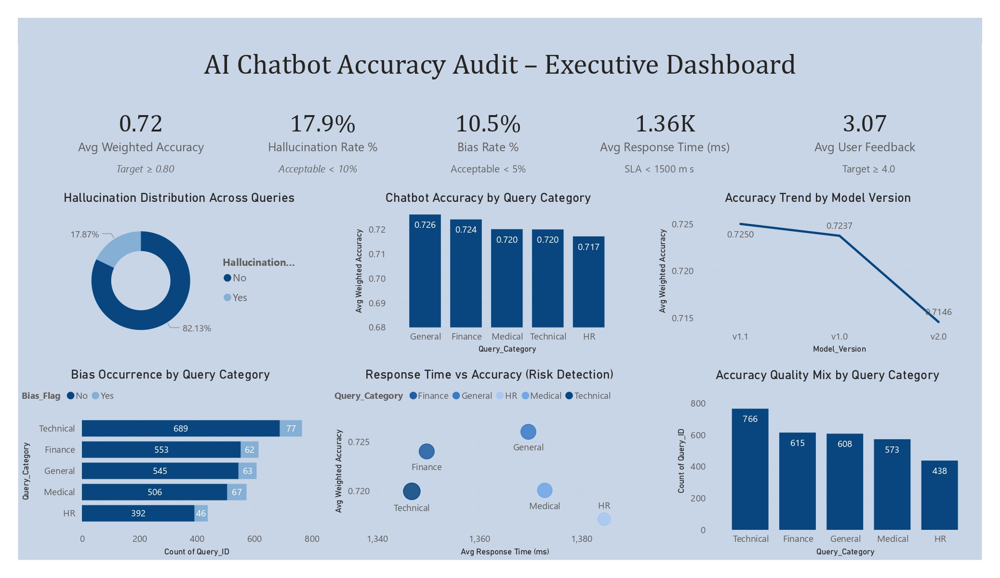

# AI Chatbot Accuracy Audit Dashboard

## Overview
This Power BI dashboard evaluates the performance and reliability of AI chatbot systems by tracking key quality metrics such as accuracy, hallucination rate, bias occurrence, response time, and user satisfaction.

## Dashboard Preview

## Key Metrics
- Average Weighted Accuracy
- Hallucination Rate %
- Bias Rate %
- Average Response Time
- Average User Feedback Score

## Dashboard Insights
### Hallucination Analysis
Shows the percentage of chatbot responses containing hallucinations.

### Accuracy by Query Category
Compares performance across:
- Technical
- Finance
- Medical
- General
- HR

### Model Version Performance
Tracks accuracy trends across different model releases.

### Bias Detection
Identifies potential bias occurrences in chatbot responses.

### Response Time vs Accuracy
Highlights risk areas where latency impacts response quality.

## Tools Used
- Power BI
- Excel / CSV Dataset
- DAX Measures
- Data Modeling

## Business Value
- Improve chatbot reliability
- Reduce hallucinations and bias
- Monitor SLA compliance
- Enhance user satisfaction
